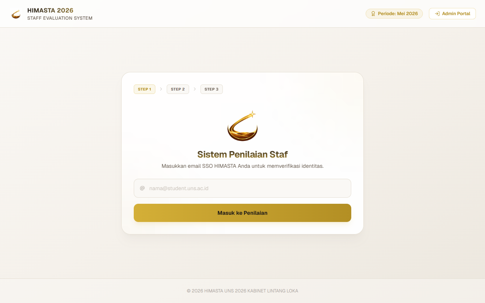
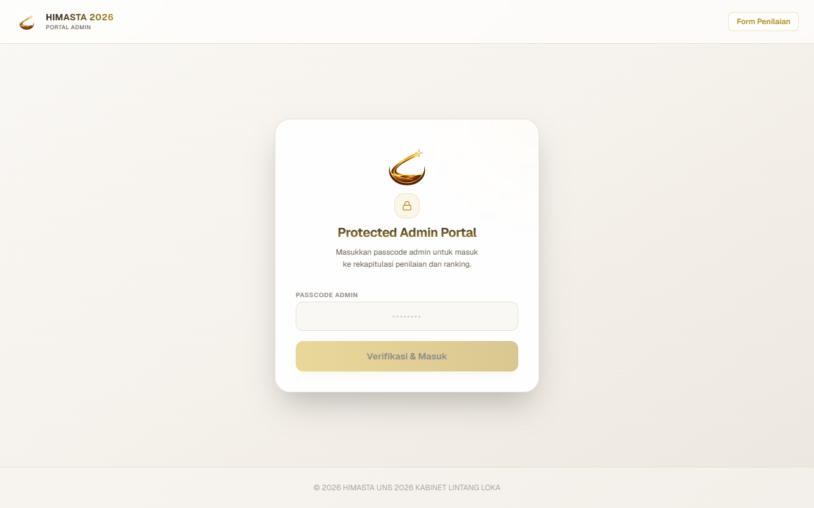

# HIMASTA Staff Evaluation System 🌟
> **Sistem Penilaian Kinerja Staf HIMASTA UNS 2026 — Kabinet Lintang Loka**

---

### 📸 Tampilan Aplikasi

| Portal Evaluasi Staf | Portal Admin (Passcode Login) |
| --- | --- |
|  |  |

---

Aplikasi berbasis web untuk memfasilitasi evaluasi berkala kinerja seluruh staf di HIMASTA UNS secara transparan, akurat, dan efisien. Sistem ini menggunakan metode penilaian tertimbang berdasarkan masukan dari Staf (Peer-to-Peer), PHT (Pengurus Harian Terbatas), dan BPH (Director/Vice Director).

---

## 🚀 Fitur Utama

### 📋 Portal Penilaian (User Portal)
* **Verifikasi Email SSO:** Pengguna masuk secara instan menggunakan email resmi student UNS (`@student.uns.ac.id`) yang sudah terdaftar.
* **Alur Pengisian Sekuensial (Sequential Flow):** Setelah mengirim nilai untuk satu staf, sistem otomatis menggulir ke atas (*auto-scroll*) dan memuat nama staf berikutnya di departemen yang sama untuk dinilai tanpa harus kembali ke menu daftar.
* **Rating Grid Premium (1-10):** Input nilai menggunakan deretan tombol angka 1-10 yang interaktif untuk menggantikan slider biasa, sehingga mencegah penilaian terlewat secara tidak sengaja.
* **Validasi Wajib Isi:** Tombol kirim otomatis terkunci jika ada indikator penilaian yang belum diisi.
* **Keamanan Data Email:** Email staf disaring di sisi server (*server-side filtering*) dan tidak pernah diekspos ke publik untuk menjaga privasi data.

### 📊 Portal Admin (Admin Dashboard)
* **Manajemen Periode Evaluasi:** Admin dapat membuat periode penilaian baru (misal: "Mei 2026") dan mengaktifkan/menonaktifkannya kapan saja.
* **Perhitungan Nilai Akhir Tertimbang:** Sistem otomatis menghitung indeks nilai akhir berdasarkan pembobotan resmi:
  * **Staf / Peer-to-Peer:** 40%
  * **PHT (Pengurus Harian Terbatas):** 50%
  * **BPH (Director/Vice Director):** 10%
* **Penyaringan Pintar:** Data peringkat (rankings) otomatis hanya menampilkan Staf saja (PHT/BPH dikecualikan dan hanya bertindak sebagai penilai).
* **Fitur Hapus Penilaian Fleksibel:**
  * **Hapus Satuan:** Menghapus penilaian spesifik jika ada kesalahan input, sehingga penilai bersangkutan dapat melakukan penilaian ulang untuk orang tersebut saja.
  * **Hapus Borongan (Batch Delete):** Menghapus seluruh penilaian dari satu penilai sekaligus dengan satu klik jika mencari nama penilai tersebut di tabel data mentah.
* **Ekspor Laporan Excel:** Unduh rekap penilaian lengkap (data nilai rapi beserta ranking akhir staf) dalam format `.xlsx` sekali klik.
* **Keamanan Ketat:** Menggunakan verifikasi *passcode* dinamis berbasis React Memory State (sandi otomatis terhapus saat berpindah halaman, di-refresh, atau menutup tab).

---

## 🛠️ Teknologi yang Digunakan

* **Core Framework:** [Next.js](https://nextjs.org/) (App Router & Serverless Routes)
* **Bahasa Pemrograman:** [TypeScript](https://www.typescriptlang.org/)
* **Database & Backend:** [Supabase PostgreSQL](https://supabase.com/)
* **Desain UI/Aesthetics:** [Tailwind CSS](https://tailwindcss.com/) dengan tema kustom premium *Milk White, Cream & Gold*
* **Set Ikon:** [Lucide React](https://lucide.dev/)
* **Pustaka Ekspor Data:** [xlsx](https://www.npmjs.com/package/xlsx)

---

## 💻 Cara Menjalankan secara Lokal

### 1. Prasyarat
Pastikan Anda sudah menginstal [Node.js](https://nodejs.org/) di perangkat Anda.

### 2. Kloning Repositori
```bash
git clone https://github.com/utsrale/himasta-evaluation.git
cd himasta-evaluation
```

### 3. Instal Dependensi
```bash
npm install
```

### 4. Konfigurasi Environment Variables
Buat berkas `.env.local` di root proyek dan isi dengan kredensial Supabase Anda:
```env
ADMIN_PASSCODE=<passcode-pilihan-anda>
NEXT_PUBLIC_SUPABASE_URL=https://<your-supabase-project-id>.supabase.co
NEXT_PUBLIC_SUPABASE_ANON_KEY=<your-anon-key>
```

### 5. Seed Database (Opsional)
Untuk memasukkan daftar staf dari file Excel ke Supabase:
```bash
node scripts/seed.js
```

### 6. Jalankan Server Dev
```bash
npm run dev
```
Buka [http://localhost:3000](http://localhost:3000) di browser Anda.

---

## 📄 Struktur Database (Supabase)

Aplikasi ini menggunakan 3 tabel utama di PostgreSQL:
1. **`staff`**: Menyimpan identitas pengurus (ID, nama, email, jabatan, departemen, role).
2. **`periods`**: Menyimpan daftar periode penilaian beserta status aktif/nonaktifnya.
3. **`evaluations`**: Menyimpan lembar nilai individu yang diinputkan oleh para penilai (nilai indikator sikap, komunikasi, improvement, profesionalisme, leadership).
